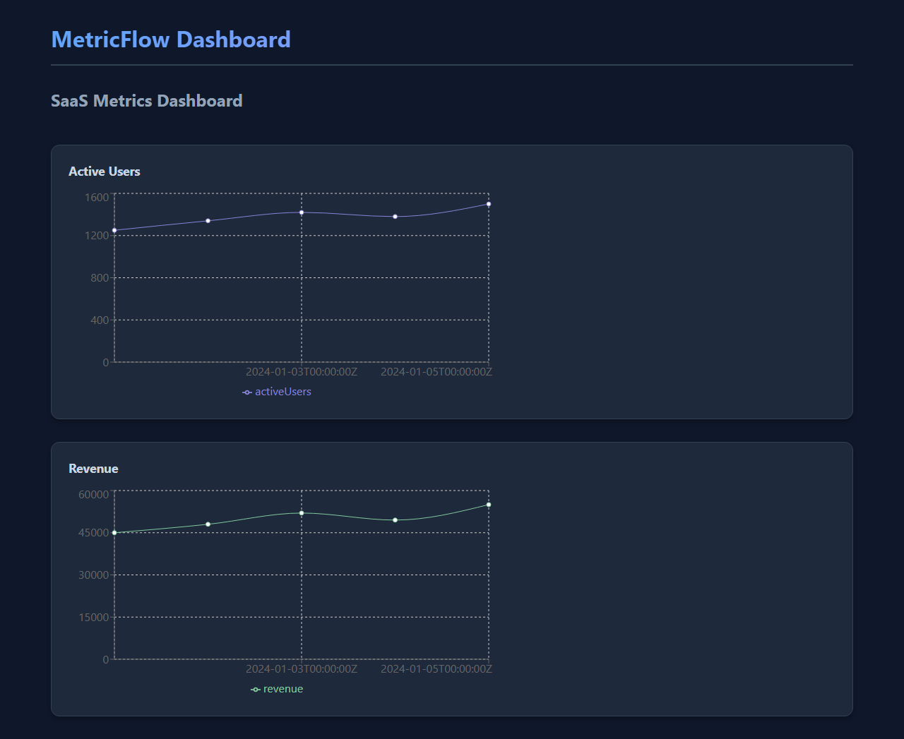
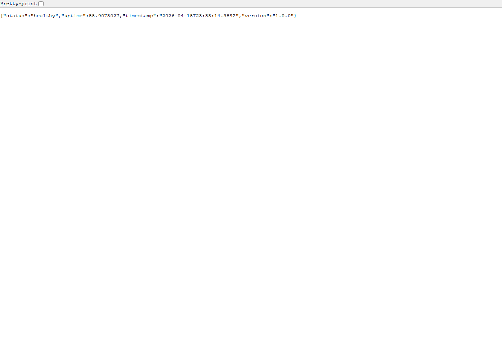
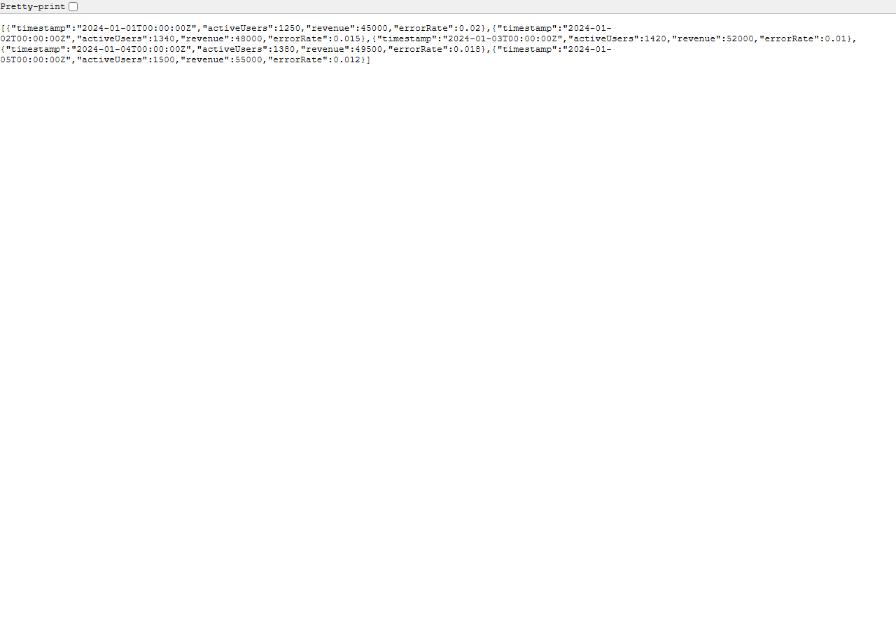
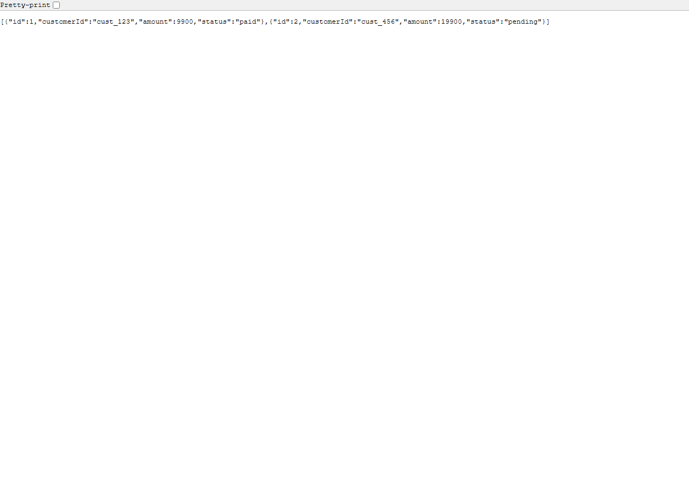
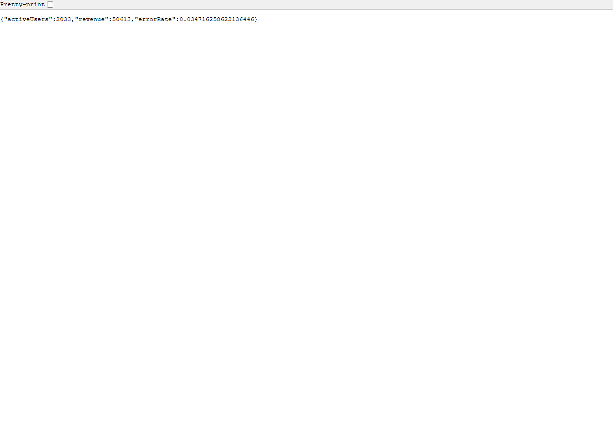

# Agentic CI/CD Pipeline

## Overview

This lab demonstrates setting up GitHub Actions workflows that integrate with SQUAD for automated testing, review, and deployment. It creates an agentic CI/CD pipeline where SQUAD agents participate in the deployment lifecycle — Eyes reviews changes before deployment, Mouth generates release notes, Brain assesses deployment risk, and Ralph monitors post-deployment health.

**Business Domain:** SaaS metrics and billing dashboard for "MetricFlow"


*The MetricFlow dashboard provides a real-time view of active users and revenue metrics.*

## Learning Objectives

By completing this lab, you will:
- Integrate SQUAD Eyes as a required status check for PRs
- Implement Brain-based deployment risk assessment with scoring
- Automate release notes generation with SQUAD Mouth
- Set up post-deployment health monitoring with Ralph
- Configure auto-rollback based on health metrics

## Prerequisites

- GitHub Actions experience (workflows, actions, environments)
- TypeScript/Node.js development experience
- Understanding of CI/CD concepts (staging, production, rollback)
- Docker Desktop
- Azure subscription (for deployment targets)

## Architecture

### Current CI/CD Pipeline (Before SQUAD)

```
PR Created → Lint → Test → Build → ✅ Merge
Merge to main → Build → Deploy Staging → Manual approval → Deploy Prod
```

### Target CI/CD Pipeline (With SQUAD)

```
PR Created → Lint → Test → Build → Eyes Review → Risk Assessment (Brain) → ✅ Merge
Merge to main → Build → Deploy Staging → Health Check → Release Notes (Mouth)
             → Risk Score Review → Deploy Prod → Post-Deploy Monitor (Ralph)
             → Auto-Rollback if health degrades
```

The CI/CD pipeline is enhanced with four SQUAD-powered stages:
1. **Pre-Deploy Review** — Eyes performs security and performance review on every PR
2. **Risk Assessment** — Brain analyzes changeset and assigns deployment risk score
3. **Release Notes** — Mouth generates markdown release notes from commit messages
4. **Post-Deploy Monitor** — Ralph watches deployment metrics and triggers auto-rollback

## Initial Application Screenshots

The MetricFlow application running locally (API on port 3200, frontend on port 3201):

### Dashboard — Active Users & Revenue Charts


### API Health Endpoint (`/api/health`)


### API Metrics Endpoint (`/api/metrics`)


### API Billing Invoices (`/api/billing/invoices`)


### API Realtime Metrics (`/api/metrics/realtime`)


## Lab Instructions

### Step 1: Run MetricFlow

**Objective:** Start the application and understand the basic CI/CD pipeline.

1. Start the development environment:
   ```bash
   docker-compose up -d
   npm install
   npm run dev
   ```

2. Verify the application:
   - Frontend: http://localhost:5173
   - API: http://localhost:3000/api/health

   
   *A successful startup returns a healthy status from the `/api/health` endpoint.*

   
   *The frontend dashboard should display active users and revenue charts.*

3. Review existing CI workflow at `.github/workflows/ci.yml`

### Step 2: Add Eyes Review Gate

**Objective:** Create workflow that triggers Eyes on PR, posts review comments.

1. Review the Eyes workflow at `.github/workflows/agentic/pre-deploy-review.yml`

2. Key features:
   - Runs on every PR open/sync
   - Analyzes code quality and security
   - Posts review comment with quality score
   - Fails if score < 70

3. Test the workflow:
   ```bash
   git checkout -b feature/test-eyes
   # Make a code change
   git commit -m "feat: add new metric"
   git push origin feature/test-eyes
   # Create PR and observe Eyes review
   ```

### Step 3: Add Risk Assessment

**Objective:** Create workflow where Brain analyzes changeset and scores risk.

1. Review the risk assessment workflow at `.github/workflows/agentic/risk-assessment.yml`

2. Risk scoring factors:
   - Number of files changed
   - Database migrations present
   - API endpoint changes
   - Dependency updates

3. Risk levels:
   - **Low (0-9)**: Standard deployment
   - **Moderate (10-24)**: Enhanced monitoring
   - **High (25+)**: Additional approval required

### Step 4: Configure Approval Gates

**Objective:** High-risk deploys require additional approval.

1. In the risk assessment workflow, high-risk changes:
   - Fail the workflow check
   - Require manual approval from tech lead
   - Post detailed risk analysis comment

2. Configure GitHub environment protection rules:
   - Settings → Environments → Production
   - Required reviewers: Add tech leads
   - Deployment branches: Only `main`

### Step 5: Add Release Notes

**Objective:** Create workflow where Mouth generates release notes on merge.

1. Review the release notes workflow at `.github/workflows/agentic/release-notes.yml`

2. Mouth analyzes commits and categorizes:
   - 🚀 Features (feat: prefix)
   - 🐛 Bug Fixes (fix: prefix)
   - 🔧 Improvements (chore:, refactor:)
   - ⚠️ Breaking Changes (BREAKING CHANGE: in body)

3. Creates draft release with generated notes

### Step 6: Add Post-Deploy Monitor

**Objective:** Create workflow where Ralph monitors health after deploy.

1. Review the monitoring workflow at `.github/workflows/agentic/post-deploy-monitor.yml`

2. Ralph checks:
   - Health endpoint status
   - Error rate < 5%
   - Response time < 500ms
   - Database connection healthy

3. Auto-rollback triggers if any check fails

### Step 7: Configure Auto-Rollback

**Objective:** Set health thresholds and trigger rollback on degradation.

1. Health check thresholds:
   ```yaml
   error_rate: 0.05  # 5% max
   response_time: 500  # milliseconds
   health_status: "healthy"
   ```

2. Rollback process:
   - Ralph detects threshold violation
   - Creates incident issue
   - Triggers rollback workflow
   - Notifies on-call team

### Step 8: End-to-End Test

**Objective:** Push a change through the full agentic pipeline.

1. Create feature branch with valid changes
2. Observe Eyes review (should pass)
3. Observe Brain risk assessment (should be low/moderate)
4. Merge to main
5. Observe Mouth generating release notes
6. Deploy to staging
7. Observe Ralph monitoring (should pass)

### Step 9: Test Rollback

**Objective:** Deploy an intentionally faulty change, verify auto-rollback.

1. Create a branch with code that increases error rate:
   ```typescript
   // In packages/api/src/routes/metrics.ts
   app.get('/realtime', async (c) => {
     if (Math.random() > 0.9) {
       throw new Error('Simulated error');
     }
     // ... rest of code
   });
   ```

   
   *The `/api/metrics/realtime` endpoint returns live metrics — the faulty code above will cause intermittent failures here.*

2. Push and merge (bypass reviews for testing)
3. Deploy to staging
4. Observe Ralph detecting high error rate
5. Verify automatic rollback triggers

## Key Concepts

### Agentic CI/CD Design Patterns

| Stage | Agent | Purpose | Trigger |
|-------|-------|---------|---------|
| Pre-Deploy Review | Eyes | Code quality, security, performance | PR open/sync |
| Risk Assessment | Brain | Changeset analysis, blast radius | PR labeled |
| Release Notes | Mouth | Automated documentation | Merge to main |
| Post-Deploy Monitor | Ralph | Health monitoring, auto-rollback | Deployment success |

### SQUAD Agent Integration

Each agent integrates via GitHub Actions:
```yaml
- name: SQUAD Agent Task
  run: |
    squad invoke <agent-name> \
      --context <context> \
      --mode <mode> \
      --output <format>
```

### Risk Scoring Methodology

```
Risk Score = (files_changed / 2) + 
             (db_migrations * 10) + 
             (api_changes * 2) +
             (dependency_updates * 3)
```

## Success Criteria

✅ MetricFlow runs with basic CI/CD pipeline  
✅ Eyes review gate runs on PR creation and posts comments  
✅ Risk assessment scores changes and categorizes risk level  
✅ High-risk deployments require additional approval  
✅ Release notes auto-generate on merge to main  
✅ Post-deploy monitor checks health metrics after deployment  
✅ Auto-rollback triggers when health degrades  
✅ Full pipeline processes a change from PR to production  

## Resources

- [GitHub Actions Documentation](https://docs.github.com/actions)
- [SQUAD Agent Reference](https://squad.dev/docs/agents)
- [Deployment Protection Rules](https://docs.github.com/actions/deployment/targeting-different-environments)

## Troubleshooting

**Issue:** Eyes review not posting comments  
**Solution:** Verify GITHUB_TOKEN has write permissions for pull-requests

**Issue:** Risk assessment always shows low risk  
**Solution:** Check that fetch-depth is set to 0 to get full git history

**Issue:** Ralph rollback not triggering  
**Solution:** Verify deployment_status webhook is configured correctly

---

**Estimated Duration:** 4-6 hours  
**Difficulty:** Intermediate  
**Category:** Cross-Cutting / End-to-End
